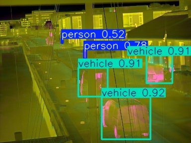
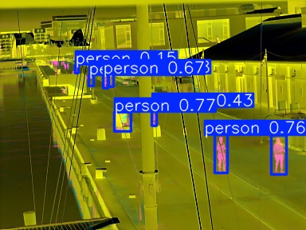

# Robust Multiclass Object Detection Under Long-Term Thermal Drift

**An End-to-End YOLOv8m-P2 Pipeline for Thermal Image Object Detection**

This repository contains the code and implementation for a custom object detection pipeline designed to tackle the object detection in low resolution thermal images.

## 📌 Overview & Challenges

Object detection in thermal imaging is notoriously difficult due to low contrast, lack of high-frequency texture, and severe environmental noise. This project specifically addresses two core challenges:

1. **Thermal Drift:** Thermal camera sensors suffer from internal temperature fluctuations that cause the baseline intensity of images to shift over time. This ruins raw absolute pixel thresholds and degrades model accuracy.
2. **Spatial Hallucinations:** Due to thermal noise, standard neural networks often confidently hallucinate objects (like vehicles or pedestrians) in physically impossible areas, such as the sky or off-road terrain.

---

## 🛠️ Design & Pipeline Architecture

To solve these challenges, an end-to-end detection pipeline was engineered with the following key components:

### 1. Strategic Oversampling (Class Imbalance)
The original dataset was highly imbalanced (e.g., Person: 85.16%, Motorcycle: 0.47%). To ensure the model learns rare objects instead of just dominant classes, minority classes were oversampled:
- Images with **Motorcycles** were copied 4 times.
- Images with **Bicycles** were copied 2 times.
This forced the network to update weights for underrepresented categories.

### 2. Combating Thermal Drift via PCA (Eigenbackground)
To isolate objects from the shifting background, Principal Component Analysis (PCA) was used:
- **Background Isolation:** Images were grouped hour-wise, object bounding boxes were masked out, and pixels were filled by averaging across the group.
- **PCA Computation:** The top 50 eigenvectors were extracted to form a matrix ($U$) that learns background variations.
- **Detector Input:** Each new frame ($I_t$) is projected into this subspace to reconstruct the pure background ($B_t$). The residual image ($R_t = I_t - B_t$) completely strips away drift. Finally, a robust 3-channel input `[I_t, B_t, R_t]` is passed to the YOLO detector.

.png)

### 3. High-Resolution Detection Head
The base **YOLOv8m** architecture was modified by adding an extra detection head at the **P2 resolution**. This specialized high-resolution head allows the model to capture and detect much smaller, low-resolution objects typical in thermal imaging.

### 4. Spatial Filtering (Inference Safety Net)
An analysis of 1 million ground-truth boxes confirmed that 100% of valid targets are located in the bottom 70% of the image. 
- A **Convex Hull** was computed to tightly wrap all valid training boxes, creating a strict "Drivable Area Polygon" mask.
- **Post-Processing:** This polygon acts as a safety net during inference. Any predicted bounding box centers that fall outside this polygon (e.g., in the sky) are automatically intercepted and deleted to prevent hallucination penalties.

---
## 🚀 Setup & Installation

**1. Clone the repository and install dependencies:**
```bash
git clone https://github.com/Debanjan2000/CV-Project.git
cd CV-Project/RTIOD/project

# Create a virtual environment (optional but recommended)
conda create -n thermal python=3.10
conda activate thermal

# Install all required packages
pip install -r requirements.txt
```

**2. Dataset Preparation:**
Download the [LTDv2 Dataset from Hugging Face](https://huggingface.co/datasets/vapaau/LTDv2) and extract it directly into the `data/` folder inside the `project/` directory.

Your folder structure should look exactly like this before running any scripts:
```text
RTIOD/project/
├── data/
│   ├── data.yaml                  # Core dataset configuration
│   ├── data_pca.yaml              # PCA dataset configuration
│   ├── images/
│   │   ├── train/
│   │   └── val/
│   └── labels/
│       ├── train/
│       └── val/
```
*(Note: The `data/` directory is automatically ignored by `.gitignore` to prevent uploading massive files to GitHub).*

---
## 📂 Project Structure

```text
RTIOD/project/
├── scripts/
│   ├── oversample_dataset.py      # (Phase 1) Duplicates minority classes to fix imbalance
│   ├── build_pca_dataset.py       # (Phase 1) Generates 3-channel PCA tensor inputs
│   └── detect_rank1.py            # (Phase 3) Convex hull spatial filtering & inference
├── configs/
│   └── rank1_yolov8m.yaml         # P2 Head (Stride 4) model configuration
└── train_rank1.py                 # (Phase 2) Distributed Data Parallel training script
```

---

## 📊 Results

The custom pipeline significantly outperformed the baseline model across multiple metrics:

- **Global mAP@50:** Achieved **0.59** (a **22% improvement** over the baseline mAP@50 of 0.48).
- **Final Balanced Score:** Raised the weighted balanced score from **0.43 to 0.48**.

 

### Class-Wise mAP Performance
| Class | mAP |
|-------|-----|
| Pedestrian (Class 0) | 0.381 |
| Bicycle (Class 1) | 0.111 |
| Motorcycle (Class 2) | 0.209 |
| Vehicle (Class 3) | 0.702 |

---
*Developed by Debanjan Das*
